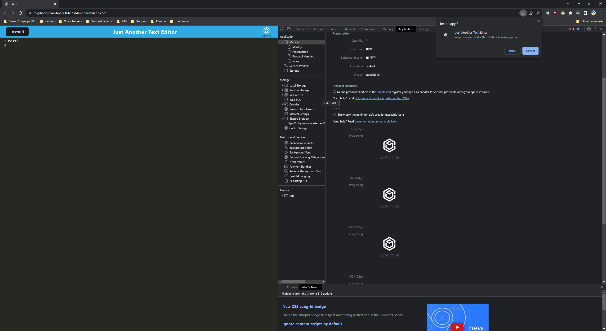

# PWA TEXT EDITIOR

## Description
  a text editor that runs in the browser
## Screenshots
  
## Table of Contents
* [Installation](#installation)
* [Features](#features)
* [Laguage & Dependencies](#language)
* [How to use](#howtouse)
* [Contributors](#contributors)
* [Testing](#testing)
* [Questions](#questions)
* [License](#license)
## Installation
    npm Install
## Features
    runs a webpack to allow the text editor to be downloadable
## Language & Dependencies
    JavaScript, bable, css-loader,html-webpack, style-loader, webpack, idb
## How to use
    how to download the application and use commands
## Contributors
    mlgibson8
## Testing
    npm run text
## Questions
    Please contact me at mlgibson8@gmail.com for any questions.
## License
    
## Deployed Application URL
    https://mlgibson-pwa-text-e16fc99d4a2c.herokuapp.com/

